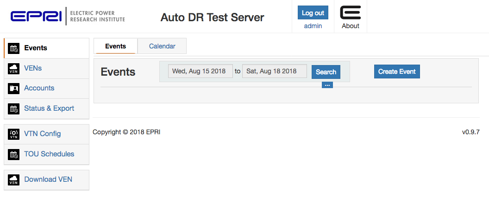

# OpenADR Virtual Top Node Vagrant VM



This project contains a Vagrant setup for a complete [OpenADR Virtual Top Node][vtn]
development environment using a Linux virtual machine. Once you have Vagrant and
VirtualBox installed, you can run:

```sh
vagrant up
```

from this directory to start up and provision the virtual machine. The machine will
enable port forwarding to the VTN on port `58080` so to access it visit
http://localhost:58080 in your browser (once it has booted completely). There is an
**admin** user with password **testing**.

The VTN uses a Postgres database named `epri_oadr`, accessible via a **epri** user with
password **epri**. Port `55432` is also forwarded to the Postgres server, so you can
connect directly to the VTN database with normal Postgres tools from your workstation,
such as:

```sh
psql -h localhost -p 55432 -d epri_oadr -U epri
```

The VTN is controlled by a `systemd` service named `oadr-vtn` and is configured to start
when the system boots. You can manually control the service like any other, e.g.

```sh
systemctl restart oadr-vtn
```

The VTN server and configuration is all owned by the **oadrdev** user, with files stored
in the `/home/oadrdev` directory. The user's password is **oadrdev**.

 [vtn]: https://github.com/epri-dev/OpenADR-Virtual-Top-Node
